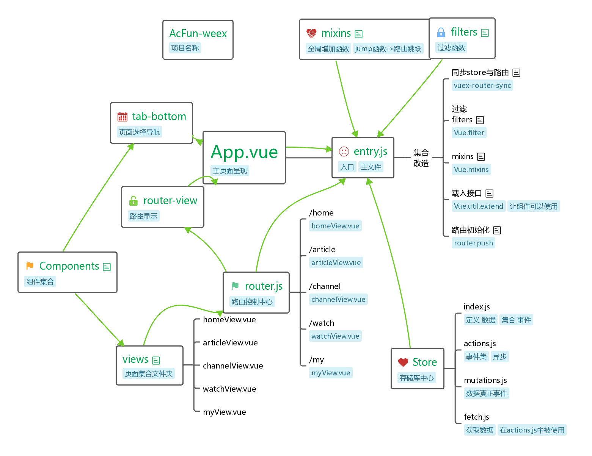

# Acfun Weex



 图片瞎拉的

 
这个项目的 配置是 fork [weex-hacknews](https://github.com/weexteam/weex-hackernews)

只是浅试了一下 Acfun 首页 发现写下去，就是在写一个样式，因为没有 acfun api

样式的更多可以查看 [](https://github.com/zwwill/yanxuan-weex-demo/stargazers)[严选高仿](https://github.com/zwwill/yanxuan-weex-demo)

真正写了一个客户端 连接 ``hacknews-api`` 可以看[](https://github.com/weexteam/weex-hackernews/stargazers)[weex-hacknews](https://github.com/weexteam/weex-hackernews)

>上面那个思维图就是参照 weex-hacknews 
>可以在 [processon.com](https://www.processon.com/view/link/59facf44e4b0f84f897610ee)查看更多

## 受不了

配置 才是最烦的 官方工具模版中 build文件夹 文件就 config 文件 就十几的还不一定对

可以了解以下 [钉钉weex微应用与微信小程序的实坑](https://zhuanlan.zhihu.com/p/28644960)

# bug

## src/components/greybar.vue ``bug``

和其他同目录文件 用 750px 但是 却没有被 weex 自适应 750/2 px


## 编译项目文件

安装依赖：

```
npm install
```

编译代码：

```bash
# 生成 Web 平台和 native 平台可用的 bundle 文件
# 位置：
# dist/index.web.js
# dist/index.web.js
npm run build

# 监听模式的 npm run build
npm run dev
```

拷贝 bundle 文件：

```bash
# 将生成的 bundle 文件拷贝到 Android 项目的资源目录
npm run copy:android

# 将生成的 bundle 文件拷贝到 iOS 项目的资源目录
npm run copy:ios

# run both copy:andriod and copy:ios
npm run copy
```

### 启动 Web 服务

```
npm run serve
```

启动服务后会监听 1337 端口，访问 http://127.0.0.1:1337/index.html 即可在浏览器中预览页面。

